# Project 4: Food Insecurity and Machine Learning

 
# Overview
Sociodemographic risk factors such as low income, unemployement, race/ethnicity,
and disability may predispose people to food insecurity, which is the limited access to healthy food in terms of distance or affordability. people experiencing food insecurity are at higher risk of obesity, chronic diseases, developmental Problems, and poor mental health. Food insecurity is a wide-spread problem with 13.8 million out of 128.6 million households being affected at least part of the year in 2020 [HHS](https://health.gov/healthypeople/priority-areas/social-determinants-health/literature-summaries/food-insecurity)

For the Food Equity ML project, we conducted an analysis of food insecurity for populations within a 1/2 radius for urban census tracts and a 10 mile radius for rural census tracts to identify potential sociodemographic risk factors. To accomplish this, we applied machine learning algorithms to analyze data from the Food Access Research Atlas published by the US Department of Agriculture (UDSA).
We further analyzed the data using geospatial mapping and data visualization tools to explore the dataset for corresponding results. 

# Methodology
* Project Data sources:
[Food Access Dataset](https://www.ers.usda.gov/data-products/food-access-research-atlas/download-the-data/), [Food Market Locations](https://overpass-turbo.eu/)
* Project Wireframe
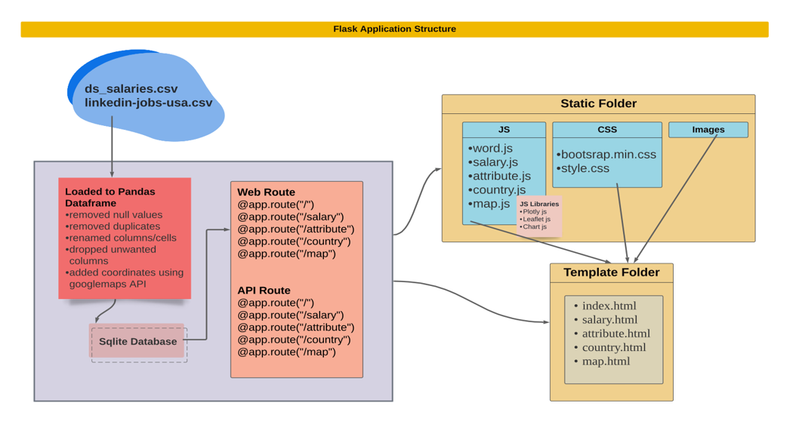

## Dataframe Creation (ETL) (MEEYOUNG)
* Multiple dataframes were created for machine learning, flask, and Tabluae visualization.
 

### Extraction
* Imported the FoodAccessResearchAtlasData2019.csv file as a Pandas dataframe 
* Confirmed a successful import by displaying the dataframe

### Transformation
* Data was cleaned and organized using following methods:
    * Slice, apply, round, lambda, drop, dropna, reset_index, isnull, duplicated, sum, describe, tolist, info, rename, groupby, agg, concat, merge, pop, corr
* State Fips column was added
* Percentage calculations were added   

### LOADING (MEEYOUNG)
* LOADED TO POSTGRESS 

## Machine Learning
Since "Food Access Dataset" is a labeled (LAhalfand10) dataset and has two class labels (0 and 1), we used binary classification supervised machine learning models.

### DATA LOADING 
* Data was loaded from AWS and confirmed
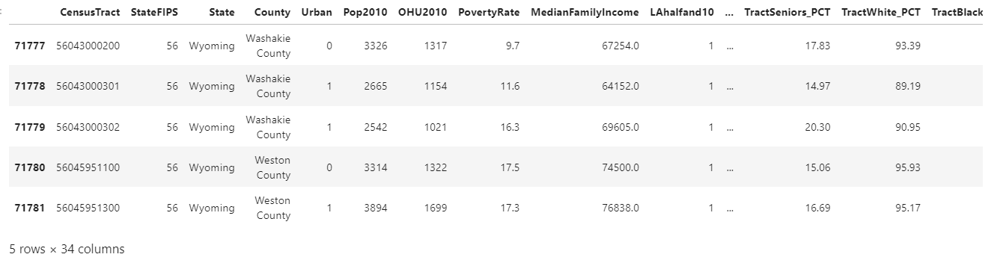

### Data Preproccessing
* Added a new column
* Dropped undesired columns
* Moved target feature to the last column
* Checked for null values
* Checked for duplicate values
* Checked correlation matrix for features
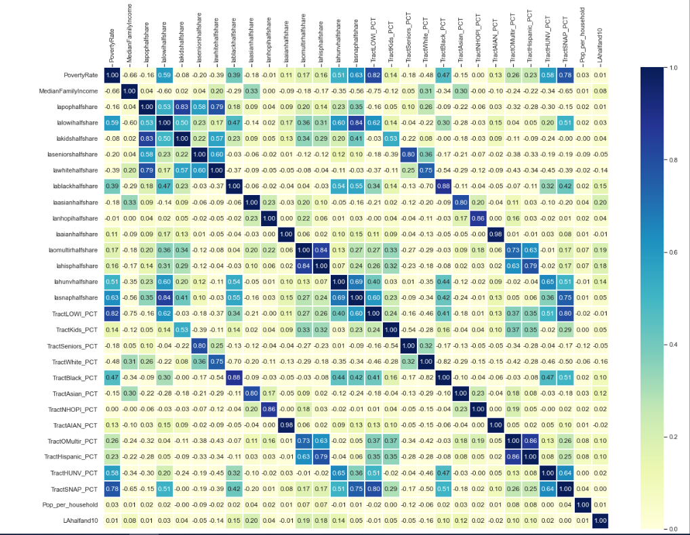

### Split Data into Training/ Testing Sets and Standardize
* Created features (X), by removing the "LAhalfand10" column 
* Created target (y) by using the "LAhalfand10" column 
* Split data into training and testing datasets using train_test_split function
* Standardized data (X) using StandardScaler function 

### Model, Fit, Predict
* Created, trained and scored the following binary classification models to select the best model for our dataset
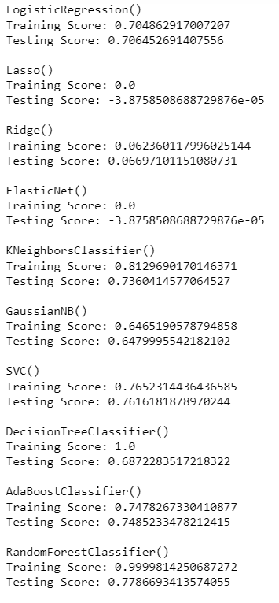
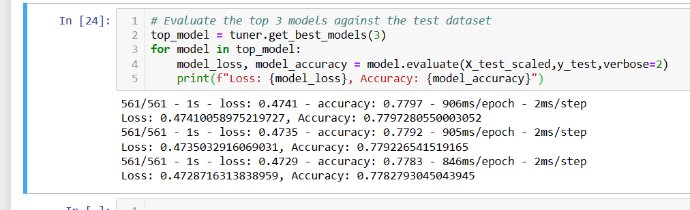
* Random forest classifier and neural network models showed the highest accuracy and hence were selected for further optimization

### Model Optimization
* Data Addition - 13 more columns were added
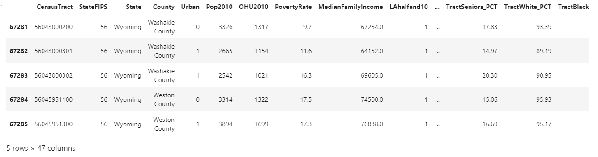 
* Classification report for bigger Random forest model
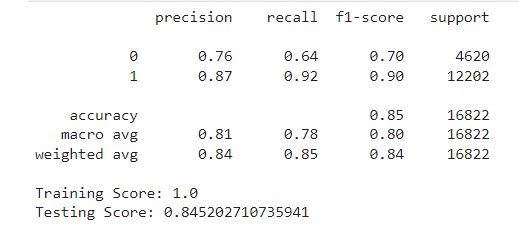
* Accuracy report for bigger Neural Network model
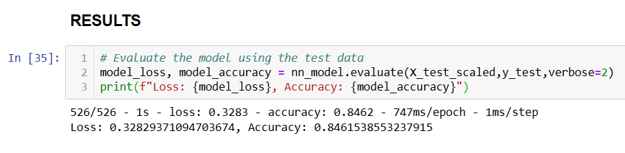
* Feature Importance
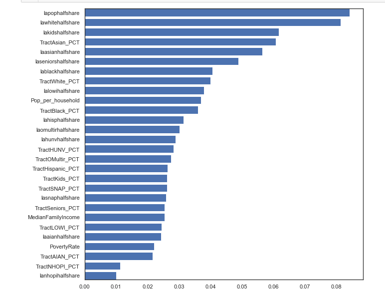
* Feature Selection Score
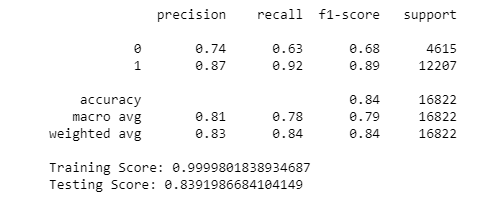

#### Random Forest Model Hypertunig with GridSearchCV
* Hypertuning Parameters - to minimize overfitting, max depth and n_estimators were tuned
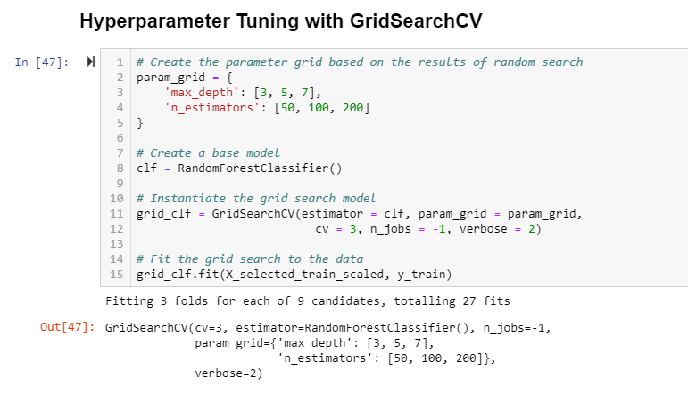
* Tuned model classification report
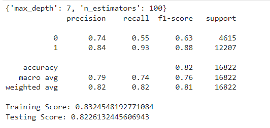
* Tree plot with best parameter ('max_depth': 7, 'n_estimators': 100)

## Visualizations
Used leaflet and Tablaue to visualize our data
* Leaflet map: used GeoJason to create a heatmap that shows food access in the US by state
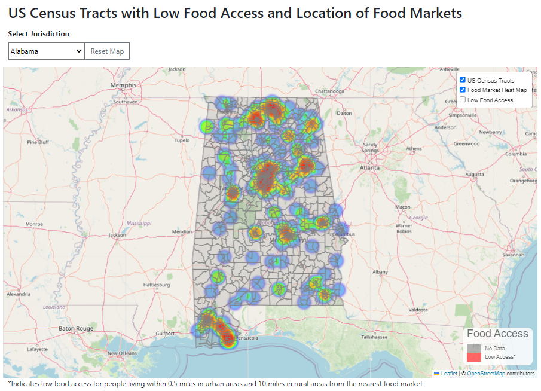
* Tablaeu Dashboard: bar charts comparing food access by different demographics
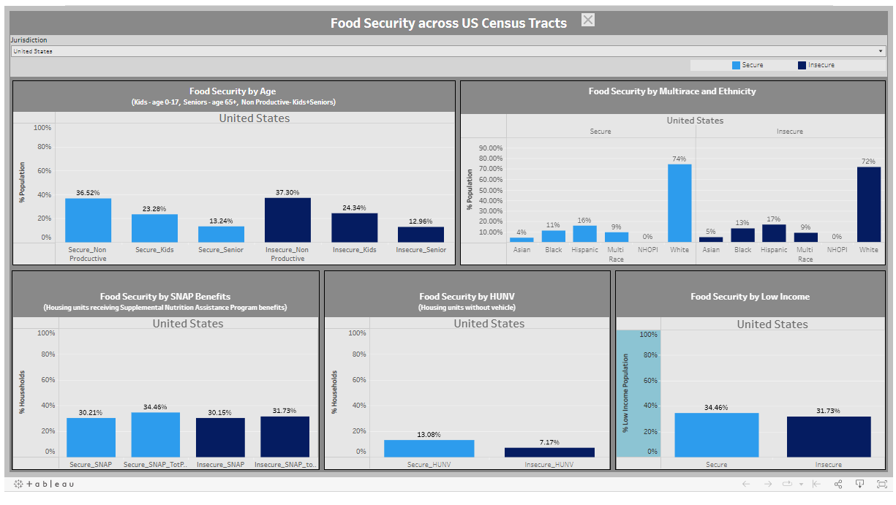

# Analysis
### Maching Learning
We created multiple dataframes (different feature numbers/ rows) from our dataset and used various binary classification models to get the best performing model. Following are the conclusions from our best model (using third dataframe):
    * Out of all the binary classification models tested, Random Forest Classifier gave the highest accuracy with overfitting (Training Score: 1.0, Testing Score: 0.84).
    *Feature addition improved model accuracy - third dataframe was created by adding 13 more features to first dataframe and it increased the accuracy from 0.78 to 0.82 for random forest classifier and 0.85 for neural network model.
    * Feature selection was not helpful in resolving overfitting issue (Training Score: 0.99, Testing Score: 0.83).
    * Hyperparameter tuning ('max_depth': 7, 'n_estimators': 200) resolved the overfitting issue (Training Score: 0.83, Testing Score: 0.82) with some decrease in accuracy (0.84 to 0.82)
    * Optimized model has a high recall (0.94) for "label 1" (low access population with food insecurity flag) which means our model is highly efficient in predicting true positives for this class (less false negatives). 

### Leaft Map (MEEYOUNG)

### Tablaeu Dashboard (DIPTI)
We compared food access by race, age SNAP, HUNV and income. 

### Limitations
* For machine learning we ran into issue of usable data after data cleaning since many columns have multiple null values. For this reason we had to create threethe third dataframe (final dataframe). Following are the specific limitation for first and second dataframes:
    * First dataframe - Even though the number of rows is high (71,782 rows), the accuracy score is pretty low (0.75).
    * Second dataframe - Even though the accuracy is high (.90), the number of rows is suboptimal (7,708 rows) for machine learning.
* As our data resides on AWS-S3 bucket , there was a limitation to connect Tableu public to AWS. Hence, we took another route and used exported cleaned, transformed, and modeled CSV file for this purpose.
* Many of data elements were missing values and hence we couldn’t use some important columns which could have given us a better understanding of this dataset.

# References/ Sources
* https://foodtank.com/wp-content/uploads/2022/04/vince-veras-sYaK3SlGwEw-unsplash.jpg
* https://leafletjs.com/
* https://www.tableau.com/

